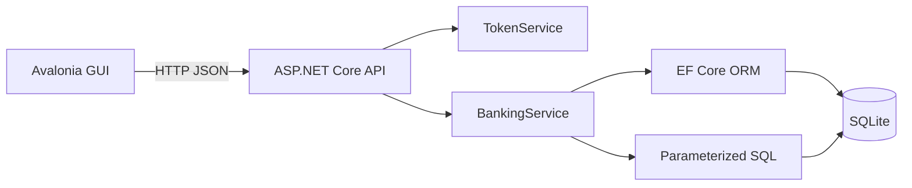
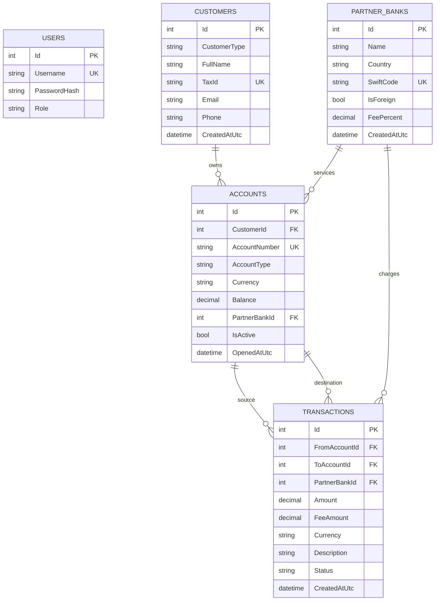
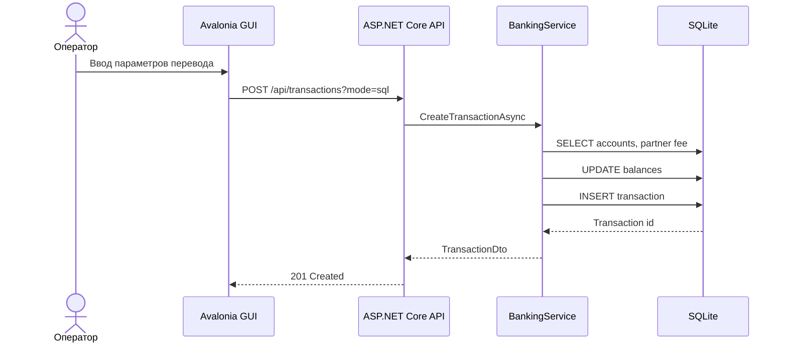

# Отчет по проекту

## Тема

Вариант 9: банковские транзакции.

Система регистрирует транзакции, обновляет счета клиентов, учитывает несколько видов счетов: зарплатный, валютный, накопительный. Клиентами могут быть юридические и физические лица. У клиента может быть несколько счетов. У банка есть партнеры, включая зарубежные банки. База данных хранит клиентов, счета, транзакции, комиссии и банки-партнеры.

## Состав решения

| Проект | Назначение |
|---|---|
| `BankTransactions.Server` | Консольный HTTP-сервер, бизнес-логика, авторизация, работа с SQLite |
| `BankTransactions.Client` | Оконный Avalonia-клиент для оператора банка |
| `BankTransactions.Shared` | DTO-контракты между клиентом, сервером и тестами |
| `BankTransactions.Tests` | Unit и сквозные xUnit-тесты |

## Используемые технологии

- C# / .NET 8.
- ASP.NET Core Minimal API как консольная серверная часть.
- HTTP JSON как протокол взаимодействия между оконным клиентом и сервером.
- SQLite как локальная база данных.
- Entity Framework Core как ORM.
- Параметризованные SQL-запросы через ADO.NET connection EF Core.
- Avalonia UI как оконный кроссплатформенный клиент.
- xUnit для unit и сквозных тестов.

## Архитектура

Приложение разделено на две основные части. Оконный клиент не обращается к базе напрямую. Все операции идут через HTTP API сервера. Сервер проверяет bearer-токен, валидирует входные данные, выбирает режим доступа к БД (`orm` или `sql`) и возвращает DTO.



Полные диаграммы:

- [IDEF0 контекст](diagrams/context-idef0.mmd)
- [IDEF3 процесс](diagrams/idef3-process.mmd)
- [DFD](diagrams/dfd.mmd)
- [Use Case](diagrams/use-cases.mmd)
- [Class Diagram](diagrams/class-diagram.mmd)
- [Sequence Diagram](diagrams/sequence-transfer.mmd)
- [Схема БД](diagrams/db-schema.mmd)

## Схема базы данных



## Реализованные функции

| Область | Реализация |
|---|---|
| Авторизация | `/api/auth/login`, bearer-токен, middleware-проверка токена |
| Хеширование пароля | PBKDF2 + соль + SHA-256, пароль в открытом виде не хранится |
| Клиенты | Добавление, изменение, удаление, поиск с фильтром |
| Счета | Добавление, изменение, удаление, поиск с фильтром |
| Банки-партнеры | Добавление, изменение, удаление, поиск с фильтром |
| Транзакции | Создание перевода, изменение описания, удаление с откатом баланса, поиск |
| SQL/ORM | Для CRUD/search операций доступен `mode=orm` и `mode=sql` |

## SQL и ORM

Один endpoint может работать двумя способами. Например:

- `GET /api/customers?mode=orm&search=Ivan`
- `GET /api/customers?mode=sql&search=Ivan`

ORM-ветка использует `DbContext`, LINQ и `SaveChangesAsync`. SQL-ветка использует SQL-команды с параметрами `$id`, `$name`, `$pattern`, поэтому пользовательский ввод не склеивается со строкой запроса.

Фрагмент SQL-поиска клиентов:

```csharp
SELECT Id, CustomerType, FullName, TaxId, Email, Phone, CreatedAtUtc
FROM Customers
WHERE $pattern = '%%'
   OR FullName LIKE $pattern
   OR TaxId LIKE $pattern
   OR Email LIKE $pattern
   OR Phone LIKE $pattern
ORDER BY FullName
```

Фрагмент ORM-поиска:

```csharp
query = query.Where(customer =>
    customer.FullName.Contains(value)
    || customer.TaxId.Contains(value)
    || customer.Email.Contains(value)
    || customer.Phone.Contains(value));
```

## Авторизация

При первом запуске создается пользователь:

- username: `admin`
- password: `admin123`

В таблице `Users` сохраняется только строка формата:

```text
iterations.base64_salt.base64_hash
```

Проверка пароля выполняется через PBKDF2 и `CryptographicOperations.FixedTimeEquals`.

## Проведение транзакции

Сценарий перевода:

1. Пользователь выбирает счет списания, счет зачисления, банк-партнер, сумму и валюту.
2. API проверяет токен.
3. `BankingService` проверяет активность счетов, валюту и достаточность средств.
4. Комиссия считается по `PartnerBank.FeePercent`.
5. В одной транзакции БД обновляется баланс счетов и добавляется запись `Transactions`.



## Тестирование

Команда:

```bash
dotnet test BankTransactions.sln --no-build
```

Результат финальной проверки: 9 проверок пройдено.

| Тест | Тип | Что проверяет | Результат |
|---|---|---|---|
| `PasswordHasherTests.Hash_DoesNotStorePasswordAndVerifiesOriginalValue` | Unit | Пароль не хранится открыто, верный пароль проходит, неверный отклоняется | Passed |
| `UnitBehaviorTests.DataAccessModeParser_Parse_ReturnsExpectedMode` | Unit | Корректный выбор режима SQL/ORM, включая значения по умолчанию | Passed |
| `UnitBehaviorTests.AccountNumberGenerator_Create_ReturnsRussianAccountLikeNumber` | Unit | Номер счета имеет ожидаемый префикс, длину и цифровой формат | Passed |
| `ServiceFlowTests.CustomerCrud_WorksThroughSqlAndOrmModes` | Сквозной | Создание клиента через SQL, изменение через ORM, поиск, удаление в SQLite | Passed |
| `ServiceFlowTests.EndToEndTransfer_RecalculatesBalancesAndStoresTransaction` | Сквозной | Создание счетов, перевод через SQL, пересчет балансов, поиск транзакции через ORM | Passed |

## Запуск проекта

Сервер:

```bash
dotnet run --project src/BankTransactions.Server --urls http://localhost:5055
```

Клиент:

```bash
dotnet run --project src/BankTransactions.Client
```

Оконный клиент по умолчанию подключается к `http://localhost:5055`. При необходимости адрес можно изменить через переменную окружения `BANK_API_URL`.

## Вывод

Проект закрывает требования задания: есть консольная серверная часть с БД, оконный клиент, взаимодействие по HTTP, авторизация с хешированием паролей, CRUD/search функции через SQL и ORM, тесты, схема БД и диаграммы проектирования.
